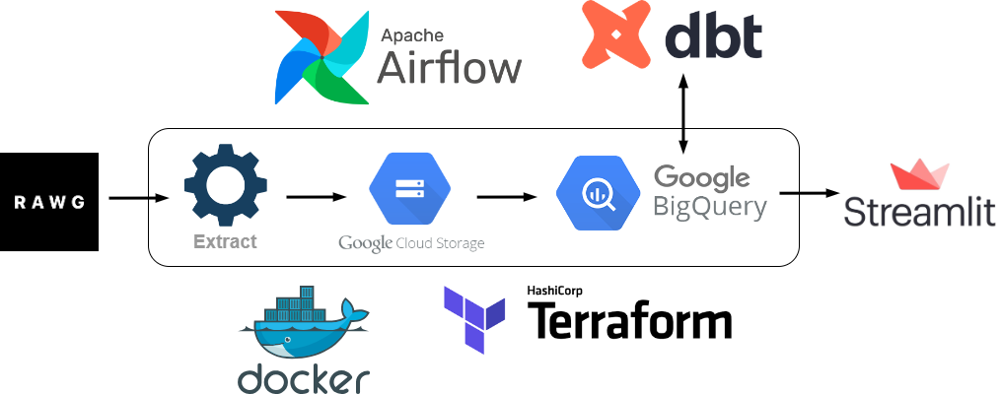
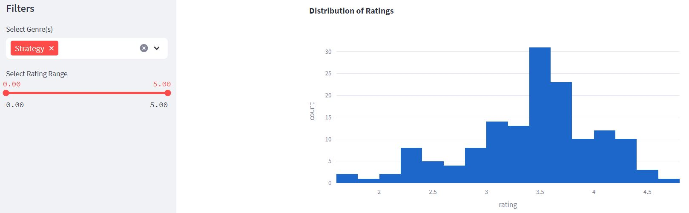

# RAWG-Data-Pipeline
A data pipeline I am working on made using RAWG's Database API to explore trends on video games through Streamlit.

# Architecture Diagram



The pipeline is orchestrated by Prefect in the following steps:
1. The data is extracted and parsed from RAWG's API
2. A connection to Google Storage is programmatically made to load the data into it
3. Data modeling is done through dbt for use in Big Query
4. Streamlit connects to BigQuery to and visualizes the data

Terraform is used to manage the Google Cloud Platform infrastructure while Docker will containerize the above steps.

CircleCI is used for CI/CD pipeline, ensuring that new code will not break the build and reflect the changes to Streamlit.

An example of how the dashboard will look:



# Requirements

Poetry is used for dependency management and the required dependencies are outline in the `pyproject.toml` and `poetry.lock` files. Refer [here](https://python-poetry.org/docs/#installation) for the installation guide.

# Getting started

Start your poetry project in the repository and install the dependencies.

```
$ poetry init
$ poetry install
```

Set the environment variable for the API key in the terminal. You'll have to register in RAWG's site [here](https://rawg.io/apidocs).

```
$ export API_KEY="enter-your-key-here"
```

Build out the infrastructure for Google Cloud Platform using Terraform. See [here](https://developer.hashicorp.com/terraform/downloads) for how to download based on your machine (I am using Debian).

```
$ terraform init
$ terraform apply
```

When you are done using the project, remember to destroy the infrastructure to avoid potential charges.

```
$ terraform destroy
```

Orchestrate the tasks for the pipeline by deploying the Prefect flow. Prefect also provides a web UI to interact with its services.
```
$ prefect deployment run 'elt/RAWG-Data-Pipeline'
$ prefect server start # Opens Prefect web UI
```
Access the web app dashboard with Streamlit. It will source the data from the data models in BigQuery into your local setup.

```
$ poetry run streamlit run streamlit/app.py
```
